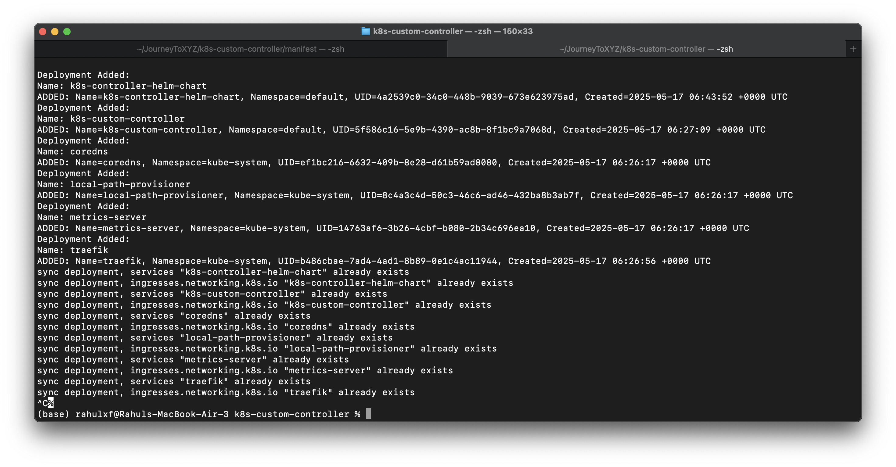

## How to upgrade helm 
```
// from the root (`charts/` subdirectory)
> helm upgrade k8s-controller-helm ./chart -f chart/values.yaml 

$ cd chart
> helm upgrade k8s-controller-helm . -f values.yaml
```

* `k8s-controller-helm`: your release name (from helm list)
* `./chart`: path to your Helm chart (adjust if it’s in a different directory)
* `-f values.yaml`: apply the updated values file

## Dry run 
```
helm upgrade k8s-controller-helm ./chart -f values.yaml --dry-run --debug
```

## If you have some tag for your docker image(like 1.0.2) 
So if you do not mention the "tag" then the helm will take the appVersion as tag for that image
Chart.yaml has `appVersion: 1.16.0` (`Pulling image "manzilrahul/k8s-custom-controller:1.16.0"`)

If you checked the `template/deployment.yaml` you will find out it have something like this 
`image: "{{ .Values.image.repository }}:{{ .Values.image.tag | default .Chart.AppVersion }}"` 
then you can change this to only look for the `.Values.image.tag` and remove even for the default 

```yaml
# values.yaml
image:
  repository: manzilrahul/k8s-custom-controller
  tag: "1.0.3"
```
After changing this you can do again `helm upgrade k8s-controller-helm ./chart -f chart/values.yaml` and 
this will or before applying this you can check by dry-run `helm upgrade k8s-controller-helm ./chart -f chart/values.yaml --dry-run --debug`
```md
* Re-render the templates using the updated logic in deployment.yaml
* Use the new values (e.g., image tag 1.0.3) from values.yaml
* Apply the changes to your running release (k8s-controller-helm)
```

> | Note 
Till now we are thinking something like we are running some application to some `:port` but we do not have that
So you will get some error like that( as we expose on :8000 - Dockerfile)

```md
Readiness probe failed: Get "http://10.42.0.14:8000/": dial tcp 10.42.0.14:8000: connect: connection refused

# Your container is starting, but your app inside is not listening on port 8000, or it takes time to start and the probe fails before it's ready.
```
❓Does main.go start an HTTP server on port 8000?
> If not, the **readiness probe** will fail because there's nothing listening at that port.

✅ 2. Probes: Check Your deployment.yaml
```yaml
readinessProbe:
  httpGet:
    path: /
    port: 8000
  initialDelaySeconds: 5
  periodSeconds: 10

livenessProbe:
  httpGet:
    path: /
    port: 8000
  initialDelaySeconds: 10
  periodSeconds: 20

---
# These will fail if your app either:
# 1). Isn’t listening on port 8000
# 2). Doesn’t serve /
# 3). Takes longer to start
```

* So main.go does not start an HTTP server at all, which is why our container is failing health checks:
```md
Readiness probe failed: dial tcp 10.42.0.14:8000: connect: connection refused
```
> We're just running a controller loop, not a web service — so the probes expecting a web server on port 8000 will always fail.

> Option 1: Remove the liveness/readiness probes
```yaml
# hart/templates/deployment.yaml, remove or comment out:
livenessProbe:
  httpGet:
    path: /
    port: 8000

readinessProbe:
  httpGet:
    path: /
    port: 8000

# then upgrade : `helm upgrade k8s-controller-helm ./chart -f chart/values.yaml`
```
> Option 2: Add a dummy HTTP health endpoint (optional) ( I am not going to do so)

```
// main.go
go func() {
	http.HandleFunc("/healthz", func(w http.ResponseWriter, r *http.Request) {
		w.Write([]byte("ok"))
	})
	log.Fatal(http.ListenAndServe(":8000", nil))
}()

> and then do this 

readinessProbe:
  httpGet:
    path: /healthz
    port: 8000
livenessProbe:
  httpGet:
    path: /healthz
    port: 8000

```

# Lets look pod describe events 
```md
Events:
Type    Reason     Age   From               Message
---
Normal  Scheduled  30s   default-scheduler  Successfully assigned default/k8s-controller-helm-chart-578458f6d4-vpdnd to k3d-rahulxf-server-0
Normal  Pulled     29s   kubelet            Container image "manzilrahul/k8s-custom-controller:1.0.0" already present on machine
Normal  Created    29s   kubelet            Created container chart
Normal  Started    29s   kubelet            Started container chart

how to access it ?? or check is it running I have some logs in my application I mean i want to check how i can see

```

# Let View Logs
`kubectl logs -f <pod-name>`
So here we get the problem for not reaching the k8s api as we are using the `network --host` in our Dockerfile 

```
As we do for running 
docker run --rm --name k8s-custom-controller \
  --network host \
  -v $HOME/.kube:/root/.kube \
  manzilrahul/k8s-custom-controller:1.0.0

---

# ok let me ask how will i add this to helm ?
--network host \
  -v $HOME/.kube:/root/.kube \

```
Since we're accessing the Kubernetes API from inside the cluster, we do NOT need to use `--network host` or `-v ~/.kube:/root/.kube`. Instead, 
we can `Use the In-Cluster Kubernetes API`
```go
import "k8s.io/client-go/rest"

config, err := rest.InClusterConfig()

// If we're using GetClientSetWithContext() or something similar and trying to use the kubeconfig file (~/.kube/config), that’s only needed for local dev (like Docker or Compose).


```

# Access Kubernetes API Securely in Kubernetes
```md
When your pod runs in Kubernetes:
It gets a ServiceAccount token automatically.
The Go client (InClusterConfig) reads this from:
/var/run/secrets/kubernetes.io/serviceaccount/token
And connects to https://kubernetes.default.svc

You do not need:
--network host
-v ~/.kube
```
> Note: if you get some error something like this, just check the "CONTEXT" env first 
```md
docker run --rm --name k8s-custom-controller manzilrahul/k8s-custom-controller
2025/05/17 09:10:49 .env file not found, assuming environment variables are set


E0517 09:10:49.942867       1 reflector.go:628] "Observed a panic" panic="runtime error: invalid memory address or nil pointer dereference" panicGoValue="\"invalid memory address or nil pointer dereference\"" stacktrace=<

or run like this
docker run --rm --name k8s-custom-controller \
-v $HOME/.kube:/root/.kube \
-e KUBECONFIG=/root/.kube/config \
-e CONTEXT="your-context-name" \
manzilrahul/k8s-custom-controller
```

# Lets tackle this error message

```md
Name: metrics-server
ADDED: Name=metrics-server, Namespace=kube-system, UID=14763af6-3b26-4cbf-b080-2b34c696ea10, Created=2025-05-17 06:26:17 +0000 UTC
Deployment Added:
Name: traefik
ADDED: Name=traefik, Namespace=kube-system, UID=b486cbae-7ad4-4ad1-8b89-0e1c4ac11944, Created=2025-05-17 06:26:56 +0000 UTC
sync deployment, services is forbidden: User "system\:serviceaccount\:default\:k8s-controller" cannot create resource "services" in API group "" in the namespace "default"
sync deployment, ingresses.networking.k8s.io is forbidden: User "system\:serviceaccount\:default\:k8s-controller" cannot create resource "ingresses" in API group "networking.k8s.io" in the namespace "default"
sync deployment, services is forbidden: User "system\:serviceaccount\:default\:k8s-controller" cannot create resource "services" in API group "" in the namespace "default"
sync deployment, ingresses.networking.k8s.io is forbidden: User "system\:serviceaccount\:default\:k8s-controller" cannot create resource "ingresses" in API group "networking.k8s.io" in the namespace "default"
sync deployment, services is forbidden: User "system\:serviceaccount\:default\:k8s-controller" cannot create resource "services" in API group "" in the namespace "kube-system"
sync deployment, ingresses.networking.k8s.io is forbidden: User "system\:serviceaccount\:default\:k8s-controller" cannot create resource "ingresses" in API group "networking.k8s.io" in the namespace "kube-system"
sync deployment, services is forbidden: User "system\:serviceaccount\:default\:k8s-controller" cannot create resource "services" in API group "" in the namespace "kube-system"
sync deployment, ingresses.networking.k8s.io is forbidden: User "system\:serviceaccount\:default\:k8s-controller" cannot create resource "ingresses" in API group "networking.k8s.io" in the namespace "kube-system"
sync deployment, services is forbidden: User "system\:serviceaccount\:default\:k8s-controller" cannot create resource "services" in API group "" in the namespace "kube-system"
sync deployment, ingresses.networking.k8s.io is forbidden: User "system\:serviceaccount\:default\:k8s-controller" cannot create resource "ingresses" in API group "networking.k8s.io" in the namespace "kube-system"
sync deployment, services is forbidden: User "system\:serviceaccount\:default\:k8s-controller" cannot create resource "services" in API group "" in the namespace "kube-system"
sync deployment, ingresses.networking.k8s.io is forbidden: User "system\:serviceaccount\:default\:k8s-controller" cannot create resource "ingresses" in API group "networking.k8s.io" in the namespace "kube-system"
^C%

Que.
so almost done i guess ,
i think i need to install the ingress controller in my dockerfile to be supported this
basically this k8s-controller is like when you create deployment in cluster it will create svc and ingress for you automatically

Ans:
> NOOOOOO
 it's failing due to missing RBAC permissions — not because of a missing ingress controller.
```
```error
User "system:serviceaccount:default:k8s-controller" cannot create resource "services"

❌ What's Missing:
I haven't granted the "k8s-controller" permission to create "Services" and "Ingresses".
```
# Add Proper RBAC (Role and RoleBinding)

```yaml
# templates/clusterrole.yaml
apiVersion: rbac.authorization.k8s.io/v1
kind: ClusterRole
metadata:
  name: {{ include "chart.fullname" . }} #  k8s-controller
rules:
  - apiGroups: ["apps"]
    resources: ["deployments"]
    verbs: ["get", "list", "watch"]
  - apiGroups: [""]
    resources: ["services"]
    verbs: ["get", "list", "watch", "create", "update"]
  - apiGroups: ["networking.k8s.io"]
    resources: ["ingresses"]
    verbs: ["get", "list", "watch", "create", "update"]

 
 # do it in separate file    
---
# templates/clusterrolebinding.yaml
apiVersion: rbac.authorization.k8s.io/v1
kind: ClusterRoleBinding
metadata:
  name: {{ include "chart.fullname" . }}
subjects:
  - kind: ServiceAccount
    name: {{ include "chart.serviceAccountName" . }}
    namespace: {{ .Release.Namespace }}
roleRef:
  kind: ClusterRole
  name: {{ include "chart.fullname" . }}
  apiGroup: rbac.authorization.k8s.io

# Why this works:
  # 1. The ClusterRole gives access to Deployments, Services, and Ingresses.

  # 2. The ClusterRoleBinding binds it to the Helm-managed ServiceAccount dynamically.

  # 3. The Deployment uses this SA automatically via templating.

  # 4. The helpers and values.yaml ensure that everything can be overridden or extended safely.


```

* 💡 Optional: Do You Need an Ingress Controller Installed?

Yes — but only if you want those Ingress resources your controller creates to actually route traffic.
If you're using k3d, you probably already have traefik installed by default (which is visible in your logs).
So you don’t need to install anything extra unless you're planning to switch to NGINX or another ingress controller.

### Ref:
* Docs for the helm & inclusterConfig:
    - https://jhooq.com/building-first-helm-chart-with-spring-boot/
    - https://jhooq.com/convert-kubernetes-yaml-into-helm/
    - https://heidloff.net/article/accessing-kubernetes-from-go-applications/
    - https://collabnix.github.io/kubelabs/golang/


