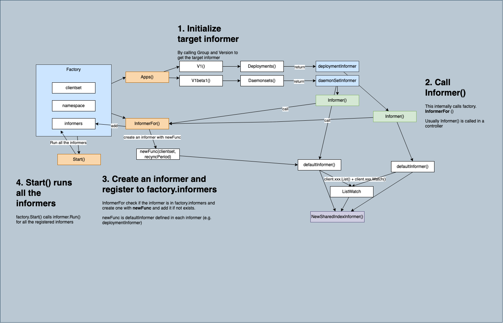
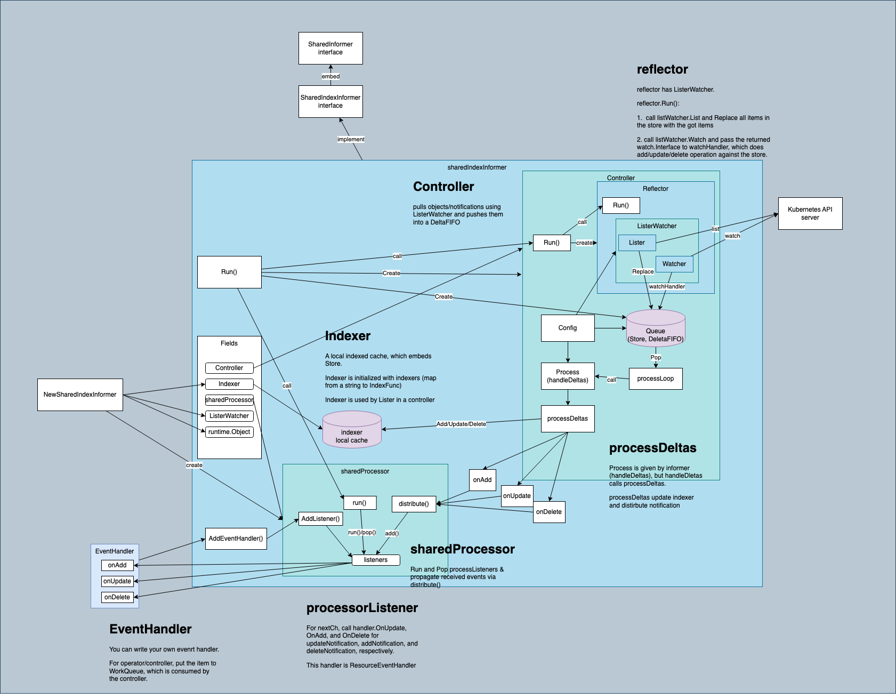
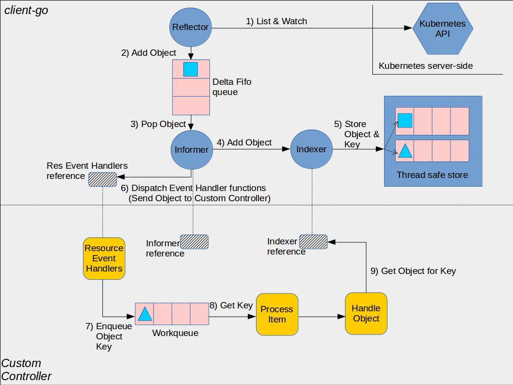

# Websocket and Informer Implementation in Golang
# Kubernetes custom controller from scratch in go

[Pull request](https://github.com/kubestellar/ui/pull/176)

## The Architecture of Controllers#
Since controllers are in charge of meeting the desired state of the resources in Kubernetes, they somehow need to be informed about the changes on the resources and perform certain operations if needed. For this, controllers follow a special architecture to

* observe the resources,
* inform any events (updating, deleting, adding) done on the resources,
* keep a local cache to decrease the load on API Server,
* keep a work queue to pick up events,
* run workers to perform reconciliation on resources picked up from work queue.

[Official Blog](https://www.nakamasato.com/kubernetes-training/kubernetes-operator/client-go/informer/)

# Factory & Informers


# Single Informer




[//]: # (https://github.com/user-attachments/assets/851d2b2b-d268-4894-a15a-dbe8b501b3cc)

## Definition : Informer

Informer monitors the changes of target resource. An informer is created for each of the target resources if you need to handle multiple resources (e.g. podInformer, deploymentInformer).

```go
package main

func main() {

	router := gin.Default()
// WATCH ALL DEPLOYMENT LOGS USING INFORMER
	router.GET("/api/wds/logs", func(ctx *gin.Context) {
		// websocket.Upgrader is responsible for upgrading an HTTP connection to a WebSocket connection.
		// CheckOrigin is a function to allow or reject WebSocket connections based on origin.
		//return true → Allows connections from any origin (not secure in production).
		var upgrader = websocket.Upgrader{
			CheckOrigin: func(r *http.Request) bool {
				return true
			},
		}
		var w = ctx.Writer
		var r = ctx.Request
		conn, err := upgrader.Upgrade(w, r, nil)
		if err != nil {
			log.Println("Failed to upgrade connection:", err)
			ctx.JSON(http.StatusBadRequest, gin.H{"error": "Failed to upgrade to WebSocket"})
			return
		}
		//defer conn.Close()
   // client: clientset to interact with API server - *kubernetes.Clientset
   // types : kubernetes.Interface
		clientset, err := wds.GetClientSetKubeConfig()
		if err != nil {
			log.Println("Failed to get Kubernetes client:", err)
			// websocket connection
			conn.WriteMessage(websocket.TextMessage, []byte("Error getting Kubernetes client"))
			return
		}
		ch := make(chan struct{})
		// initializing the informer with the NewSharedInformerFactory
		factory := informers.NewSharedInformerFactory(clientset, 10*time.Minute)
		// 
		c := wds.NewController(clientset, factory.Apps().V1().Deployments(), conn)
		factory.Start(ch)
		go c.Run(ch)
	})}

```

```go
// controller.go
package wds

// DOCS: https://github.com/kubernetes/sample-controller/blob/master/controller.go#L110-L114
// DOCS: https://medium.com/speechmatics/how-to-write-kubernetes-custom-controllers-in-go-8014c4a04235

import (
	"encoding/json"
	"fmt"
	"github.com/gorilla/websocket"
	appsv1 "k8s.io/api/apps/v1"
	"k8s.io/apimachinery/pkg/api/errors"
	"k8s.io/apimachinery/pkg/util/wait"
	appsinformers "k8s.io/client-go/informers/apps/v1"
	"k8s.io/client-go/kubernetes"
	appslisters "k8s.io/client-go/listers/apps/v1"
	"k8s.io/client-go/tools/cache"
	"k8s.io/client-go/util/workqueue"
	"k8s.io/klog/v2"
	"log"
	"time"
)
// here we are creating controller as dependency injection so we can get access this from every function easily
type Controller struct {
	clientset         kubernetes.Interface
	deploymentsLister appslisters.DeploymentLister
	deploymentsSynced cache.InformerSynced
	//workqueue         workqueue.TypedRateLimitingInterface[cache.ObjectName]
	workqueue workqueue.RateLimitingInterface // RateLimitingInterface is an interface that rate limits items being added to the queue.
	conn      *websocket.Conn
}

func NewController(clientset kubernetes.Interface,
	deploymentInformer appsinformers.DeploymentInformer, conn *websocket.Conn) *Controller {

	/*
		DOCS: https://github.com/kubernetes/sample-controller/blob/8ab9f14766821df256ea5234629493d2b66ab89d/controller.go#L110-L114
			ratelimiter := workqueue.NewTypedMaxOfRateLimiter(
				workqueue.NewTypedItemExponentialFailureRateLimiter[cache.ObjectName](5*time.Minute, 1000*time.Second),
				&workqueue.TypedBucketRateLimiter[cache.ObjectName]{Limiter: rate.NewLimiter(rate.Limit(50), 300)})
	*/
	controller := &Controller{
		clientset:         clientset,
		deploymentsLister: deploymentInformer.Lister(),
		deploymentsSynced: deploymentInformer.Informer().HasSynced,
		//  NewNamedRateLimitingQueue constructs a new named workqueue with rateLimited queuing ability.
		workqueue:         workqueue.NewNamedRateLimitingQueue(workqueue.DefaultControllerRateLimiter(), "deploymentQueue"),
		conn:              conn,
	}

	// Set up an event handler for when Deployment resources change. 
	// So when any deployment is created the AddFunc will trigger and also remember how many deployment or workload
	// you have in your cluster(context or namespace) for all it will trigger (You can see the video i linked)
	
	// UpdateFunc: as from their name you can guess it is for the update of the deployment - like when you make some 
	// changes to image or replicas it will trigger
	deploymentInformer.Informer().AddEventHandler(
		cache.ResourceEventHandlerFuncs{
			AddFunc:    controller.handleAdd,
			UpdateFunc: controller.handleUpdate,
			DeleteFunc: controller.handleDel, // when you delete the deployment or workload 
		})
	return controller
}

func (c *Controller) Run(ch <-chan struct{}) {
	fmt.Printf("starting controller")
	if !cache.WaitForCacheSync(ch, c.deploymentsSynced) {
		fmt.Printf("failed to wait for caches to sync")
	}
	// https://developer.mozilla.org/en-US/docs/Web/API/ExtendableEvent/waitUntil
	/* 
	FROM JAVASCRIPT:
	* The ExtendableEvent.waitUntil() method tells the event dispatcher that work is ongoing. It can also be used to detect whether that work was successful. 
	* In service workers, waitUntil() tells the browser that work is ongoing until the promise settles, and it shouldn't terminate the service worker if it wants that work to complete.
	*/
	
	/*
	Ref: k8s and golang
        * wait.Until(f func(), period time.Duration, stopCh <-chan struct{}) runs the given function f repeatedly at the specified interval (period).
        * It stops execution when stopCh receives a value or is closed.
        * The function runs in an infinite loop unless stopped.
	*/
	go wait.Until(c.worker, 1*time.Second, ch)
	
    // This is a blocking operation that waits until ch receives a value or is closed.
    // When that happens, the main routine stops waiting and continues execution (likely exiting the program or stopping the worker).
    <-ch
	
	c.conn.Close() // closing the websocket connection 
}

/*
// worker is a long-running function that will continually call the
// processItem function in order to read and process a message on the workqueue
*/
func (c *Controller) worker() {
	for c.processItem() {

	}
}

/*
* workqueue.RateLimitingInterface
✅It is an interface for a workqueue that supports rate limiting. It extends the basic Interface of workqueue by adding methods to rate-limit failed processing attempts.

* workqueue.NewNamedRateLimitingQueue(workqueue.DefaultControllerRateLimiter(), "deploymentQueue")
✅  This creates a named rate-limiting workqueue.

* workqueue.DefaultControllerRateLimiter() provides a default rate limiter (with exponential backoff).
"deploymentQueue" is just a name for logging/debugging purposes.
objRef, shutdown := c.workqueue.Get()


Get() blocks until an item is available in the queue.
If the queue is shutting down, shutdown will be true, and we should stop processing.
Otherwise, objRef contains the item that was added to the queue (e.g., by an informer event handler).

* key, err := cache.MetaNamespaceKeyFunc(objRef)

This function generates a unique string key (in "namespace/name" format) for Kubernetes objects.
It does not store anything. Instead, it is used as a way to identify objects in the queue uniquely.
This key is used later to extract namespace and name.
DeploymentLister helps list Deployments.

A DeploymentLister is used to efficiently list and retrieve Deployment objects from an informer’s cache.
syncDeployment -> for reconciliation
This method attempts to bring the actual state in sync with the desired state by handling changes to Deployments.
If there's an error, it usually gets re-queued (potentially with backoff).
*/
func (c *Controller) processItem() bool {
	objRef, shutdown := c.workqueue.Get()
	if shutdown {
		return false
	}
	// we do not process the item again
	defer c.workqueue.Done(objRef)
	key, err := cache.MetaNamespaceKeyFunc(objRef)
	if err != nil {
		fmt.Printf("key and err, %s\n", err.Error())
	}
	namespace, name, err := cache.SplitMetaNamespaceKey(key)
	if err != nil {
		fmt.Printf("spliting namespace and name, %s\n", err.Error())
	}

	deployment, err := c.deploymentsLister.Deployments(namespace).Get(name)
	if err != nil {
		if errors.IsNotFound(err) {
			klog.V(4).Infof("Deployment %s has been deleted", key)
			c.conn.WriteMessage(websocket.TextMessage, []byte(fmt.Sprintf("Deployment %s has been deleted", key)))
			return true
		}
		klog.Errorf("Error syncing deployment %s: %v", key, err)
		c.conn.WriteMessage(websocket.TextMessage, []byte(fmt.Sprintf("Error: syncing deployment %s: %v ", key, err)))
		c.workqueue.AddRateLimited(objRef)
		return true
	}
	
	// Implement your reconciliation logic here 
	// for more clarity see - controller/controller.go (syncDeployment function)
	
	
	log.Printf("Successfully processed deployment: %s", deployment.Name)
	c.conn.WriteMessage(websocket.TextMessage, []byte(fmt.Sprintf("Successfully processed deployment: %s", deployment.Name)))
	return true
}

// will trigger how much deployment you have and when you create new one
func (c *Controller) handleAdd(obj interface{}) {
	c.workqueue.Add(obj)
}

// most important
func (c *Controller) handleUpdate(oldObj, newObj interface{}) {
    // The assertion newObj.(*appsv1.Deployment) attempts to extract the actual *Deployment object.
    newDepl, ok1 := newObj.(*appsv1.Deployment) // type assertion - used to convert an interface{} to a specific type.
	oldDepl, ok2 := oldObj.(*appsv1.Deployment)
	if !ok1 || !ok2 {
		return
	}
	if newDepl.ResourceVersion == oldDepl.ResourceVersion {
		// Periodic resync will send update events for all known Deployments.
		// Two different versions of the same Deployment will always have different RVs.
		return
	}
	c.updateLogs(newDepl, oldDepl)
	c.workqueue.Add(newObj)
}

func (c *Controller) handleDel(obj interface{}) {
	deployment, ok := obj.(*appsv1.Deployment)
	if !ok {
		return
	}
	message := fmt.Sprintf("Deployment %s deleted", deployment.Name)
	log.Println(message)
	c.conn.WriteMessage(websocket.TextMessage, []byte(message))
	c.workqueue.Add(obj)
}

type DeploymentUpdate struct {
	Timestamp string `json:"timestamp"`
	Message   string `json:"message"`
}

/*
Current we only look for - Replica and Image
In future we will extend it
*/
func (c *Controller) updateLogs(newDeployment, oldDeployment *appsv1.Deployment) {
	var logs []DeploymentUpdate
	if *oldDeployment.Spec.Replicas != *newDeployment.Spec.Replicas {
		logs = append(logs, DeploymentUpdate{
			Timestamp: time.Now().Format(time.RFC3339),
			Message:   fmt.Sprintf("Deployment %s updated - Replicas changed: %d", newDeployment.Name, *newDeployment.Spec.Replicas),
		})
		fmt.Println(logs)
	}
	oldImage := oldDeployment.Spec.Template.Spec.Containers[0].Image
	newImage := newDeployment.Spec.Template.Spec.Containers[0].Image

	if oldImage != newImage {
		logs = append(logs, DeploymentUpdate{
			Timestamp: time.Now().Format(time.RFC3339),
			Message:   fmt.Sprintf("Deployment %s updated - Image changed: %s", newDeployment.Name, newImage),
		})
		fmt.Println(logs)
	}
	for _, logLine := range logs {
		jsonMessage, _ := json.Marshal(logLine)
		fmt.Println(string(jsonMessage))
		if err := c.conn.WriteMessage(websocket.TextMessage, jsonMessage); err != nil {
			log.Println("WebSocket write error:", err)
			return
		}
	}
}

```

